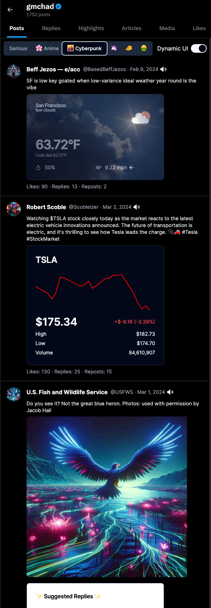
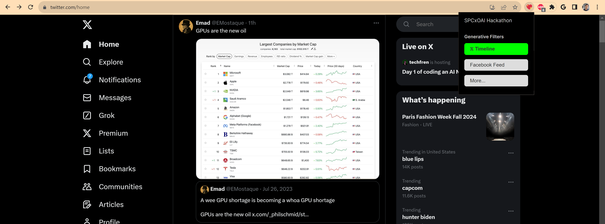

# Generative-X

Generative-X (twitter) augments your twitter timeline with AI using image filters, text-to-speech, auto replies, and dynamic UI components that pop in to give more context to tweets!

Built during the SPCxOpenAI Hackathon

## Demo Video 
[Watch the video on X](https://x.com/ultrasoundchad/status/1764464890960638099?s=20)

## Getting Started
Under the hood, there's a nextjs application and a chrome extension used to pull tweets off of your feed and inject the nextjs app as an iframe into X

Let's start by running the nextjs app wwhich will use a sample twitter feed
1. Add your OPENAI_API_KEY and ELEVENLABS_API_KEY (used for tts)  
`cp .env.local.example .env.local`
2. Run the application   
`npm run dev`
3. Try out the image filters (these will be snappy as they're cached)
4. Try out the dynamic UI switch

## Chrome Extension
You'll need to load the extension into your browser to use it

### Installation

1. Download this repo - the extension is in the `chrome_extensions/src` folder (where this file is)
2. Open Chrome > Go to Extensions
3. Enable Developer mode (switch top-right)
4. Click on "Load unpacked" and select the `src` folder at the same level of this file

### Usage

1. Browse to https://twitter.com
2. Click on the extension icon in the toolbar (heart-shaped for now)
3. Select "X Timeline" from the menu
	 

## Dynamic User Interfaces
There are currently 5 dynamic components that can be rendered based on tweet context. We use GPT3.5 with function calling to determine which component to render. 

Dynamic User Interfaces (DUIs) can be found in `/app/components/dui`

1. `weather.tsx`  
Renders live weather data if location and "weather" is mentioned in a tweet

2. `stocks.tsx`  
Renders live stock data if a ticker symbol i.e $TSLA is mentioned in a tweet

3. `poltics.tsx`
Renders a political scale with refeference links (generated from perplexity sonar) if a tweet is poltical

4. `clothing.tsx`  
This component will try to match the clothing items in a tweet image to items in the Nordstrom Rack catalog. For the demo it will only render for tweets under the [@TechBroDrip](https://twitter.com/TechBroDrip0)

5. `Reply.tsx`  
Renders a few suggested replies with tts in a reply component. This is the default component is there are not other components rendered.

## Adding New Components
This application gets better with more components. If you have ideas for components that could augment the X experience, open a PR. 

Docs on adding new components flow coming soon.

